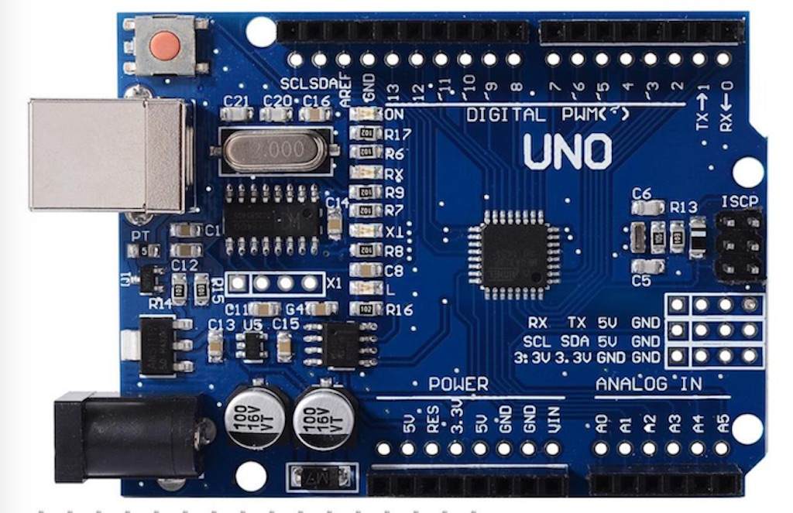
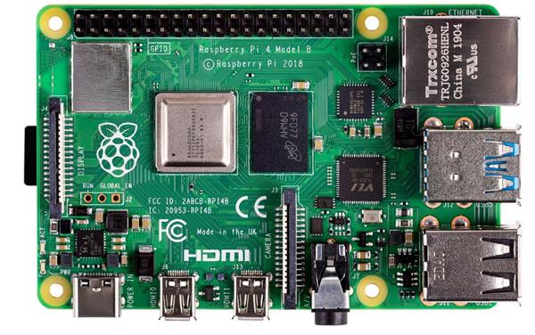
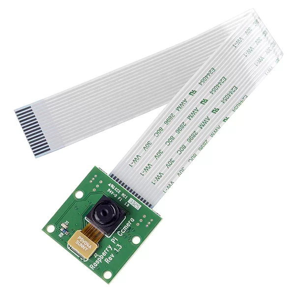
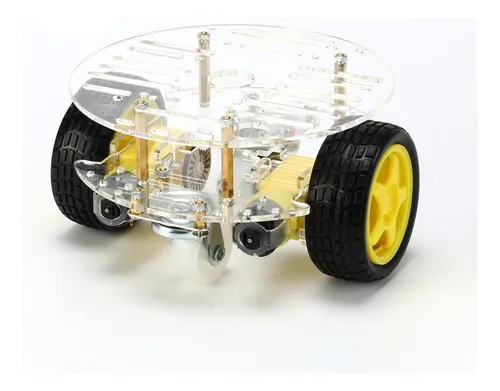
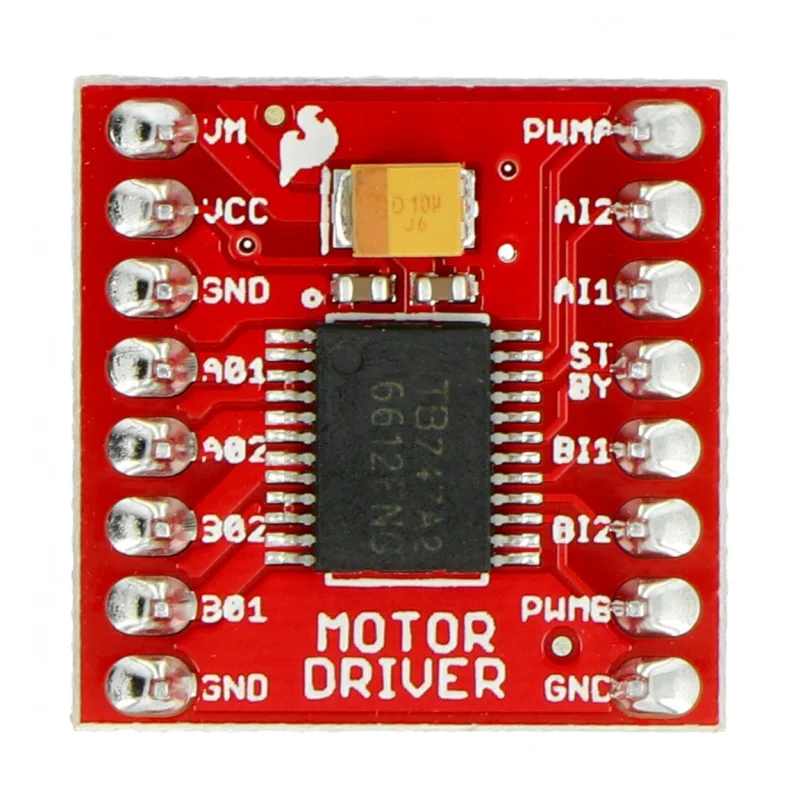
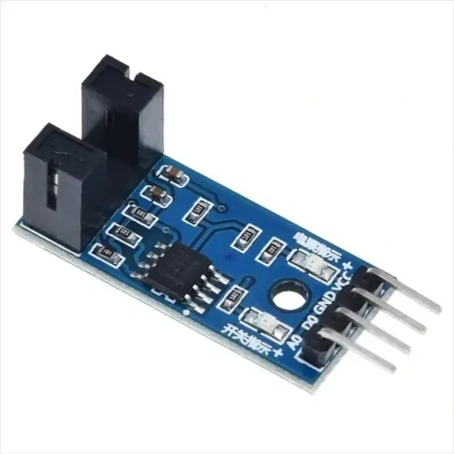
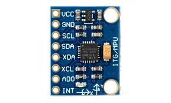
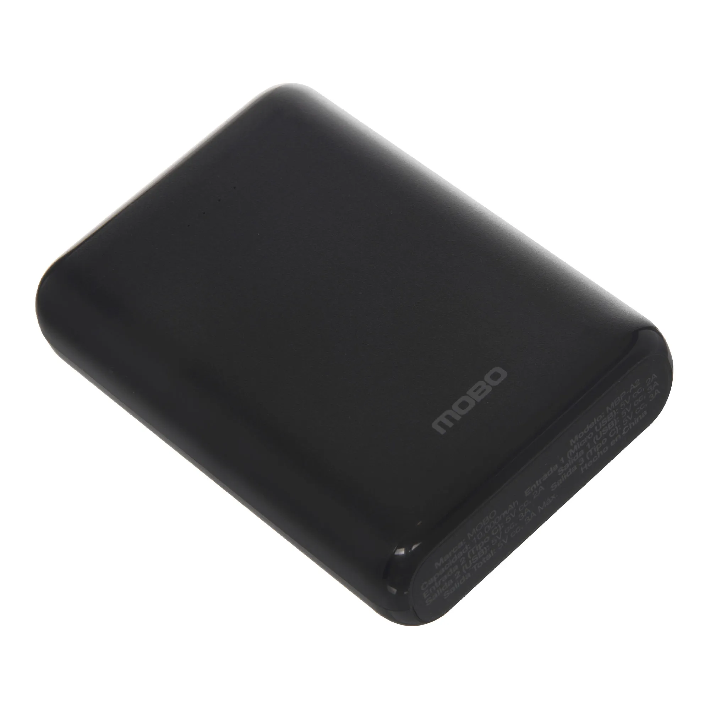
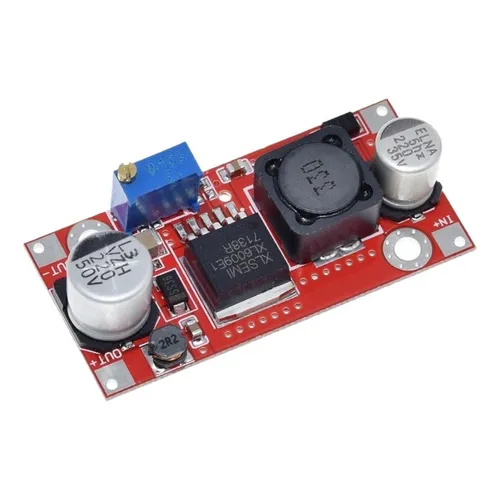
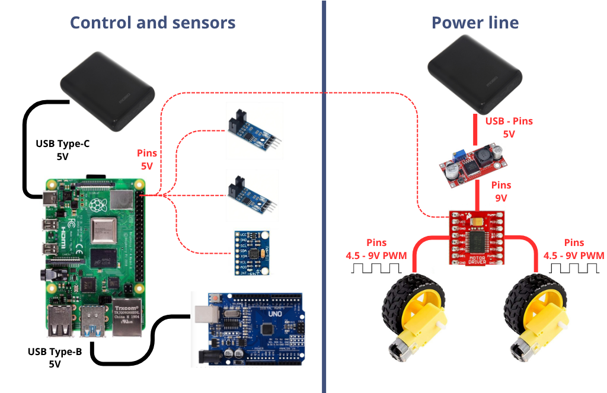

# ROS2 Mobile Robot Aerisbot 1 🚗📷

This is a small differential robot built with ROS2 Humble. It includes basic IMU-based orientation, camera streaming, and motor control.

This project is based on the articubot_one developed by joshnewans: https://github.com/joshnewans/articubot_one/tree/main.

He has a sweet youtube tutorial series too 🦾: https://www.youtube.com/@ArticulatedRobotics

## What makes Aerisbot 1 different? 🤔
My main goal is to construct a functional differential robot based in ROS2 with the lowest possible budget and able to be acquired locally.

Other objective that I considered was to obtain an accurate odometry to reflect the robot position in a virtual environment (Gazebo) and in the future add control algorithms. To do it I thought it was a good idea to experiment with odometry fusion combining two sensor readings (Sensor Fusion for State Estimation: IMU sensor + wheel encoders) 🤓 

Slam? Self-driving? machine learning? well, I intend to cover that in the future. 🚀🚀

## Bill of Materials 🛠️

| Item | Description| Image |
| ------------- | ------------- |---|
| **Arduino UNO** |  A microcontroller board based on the ATmega328P, used for low-level motor control and reading sensor data such as wheel encoders or IMU sensor |  |
| **Raspberry Pi 4B** | A powerful single-board computer running Ubuntu with ROS2, acting as the main processing unit for high-level tasks like sensor fusion, navigation, and camera processing |   |
| **Raspberry Pi Camera** | A compact camera module connected to the Raspberry Pi, used for capturing visual data for applications like computer vision, object detection, or SLAM |   |
| **Differential robot case** | A chassis designed for differential drive robots, typically with two independently driven wheels and a caster wheel, providing the mechanical base for the robot |  |
| **TB6612FNG Dual H-Bridge Motor Driver** | A motor driver that allows the Raspberry Pi or Arduino to control the speed and direction of two DC motors independently, with higher efficiency than older drivers like the L298N (optional) |  |
| **2 × MOCH22A Optical Encoders** | Wheel encoders that measure the rotation of the motors, providing feedback for odometry to estimate distance traveled and speed |  |
| **MPU6050** | A 6-axis IMU (Inertial Measurement Unit) combining a 3-axis gyroscope and 3-axis accelerometer, used for orientation and motion tracking |  |
| **Battery Pack / Power Bank** | A portable power source that supplies regulated voltage to the Raspberry Pi and possibly the motors, enabling mobile operation |  |
| **LTC3442 Boost Converter** | A step-up DC-DC converter used to regulate and boost voltage from the battery to ensure stable power delivery to motor driver |  |

## Connecting everything 🔌
During tests the overall spend current surpasses the rated current of a power bank (2A) activating the protection and shutting down the RaspberryPI during heavy duty tasks. This power bank is the cheapest one I could get, so I decided to use two of them as power source, one for energizing control/sensors and the other to feed the motors.

### Control and sensors power source 🪫
The connection is pretty straightforward, the Raspberry PI is connected directly with a USB Type C cable to one of the power banks and the rest of the connections for this side are derived from it. The Arduino UNO is energized through an USB connection, which will serve as serial communication path too and the rest of the sensors like the gyroscope and encoders are connected to the 5V pins inside the Raspberry PI. Additionally, the motor driver needs to be powered by supplid with logic 5V for motor control.

> ⚠️ It is important to note that if high power demand USB devices such as cameras o lidars need to be connected to the Raspberry PI, USB hub with independent power source should be used to not stress the socket. The raspberry is only capable of delivering 1.2A of current throgh the USB ports combined.

### Motors power source ⚡
To extract the maximum possible speed from the motors, I used a boost converter that transform the 5V of the power bank to the 9V motor rated voltage. It also regulates the output voltage delivered to the motor driver, which adjust the speed of the motors using Pulse Width Modulation (PWM) according to the control signals received.

Meanwhile, the rest of the documentation 😅:

